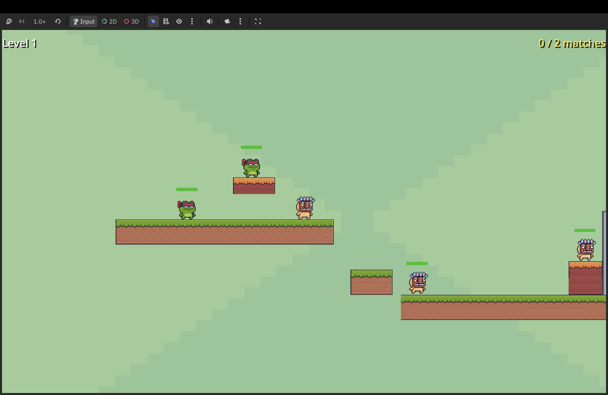
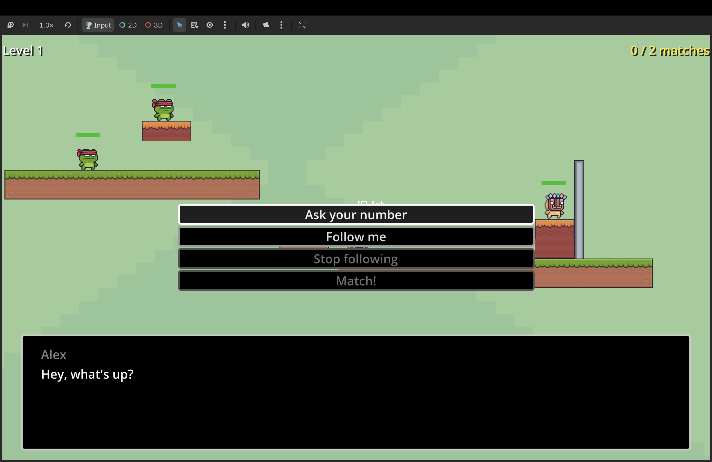

# Number Match Party (Matching Party) - Dokumentacja Projektu

## Spis treści

1. [Krótki opis gry](#1-krótki-opis-gry)
2. [Użyte narzędzia](#2-użyte-narzędzia)
3. [Mechanika gry](#3-mechanika-gry)
4. [Użyte assety](#4-użyte-assety)
5. [Wykorzystanie sztucznej inteligencji (AI)](#5-wykorzystanie-sztucznej-inteligencji-ai)
6. [Instrukcja uruchomienia gry](#6-uruchomienie-gry)
7. [Zrzuty ekranu (Screenshots)](#7-screenshots)
8. [Bibliografia i źródła](#8-bibliografia)

---

### 1. Krótki opis gry

**Tytuł:** Number Match Party (znana również jako _MatchParty_)

**Koncepcja i cel gry:**
Gra jest dwuwymiarową platformówką (2D platformer) z elementami gry pamięciowej (memory) oraz strategicznym zarządzaniem relacjami i cierpliwością postaci NPC. Zadaniem gracza jest przemieszczanie się po poziomach, rozmawianie z napotkanymi przyjaciółmi (NPC) i odkrywanie przypisanych im na początku poziomu ukrytych liczb. Gracz może nakazać jednemu z przyjaciół podążanie za sobą, a następnie doprowadzić go do innej postaci z identycznym numerem, aby ich połączyć (sparować). Poziom zostaje ukończony, gdy wszystkie pary zostaną pomyślnie dobrane. Grę utrudnia zarządzanie indywidualną cierpliwością każdego NPC - wyczerpana cierpliwość sprawia, że postać odmawia podania swojej liczby i przestaje podążać za graczem.

Sukces wymaga od gracza trzech równoległych umiejętności: **pamięci** (zapamiętywanie liczb, by nie marnować cierpliwości na powtórne pytania), **zręczności** (pokonywanie przeszkód platformowych i bezpieczne prowadzenie NPC) oraz **strategii** (kolejność odpytywania postaci, planowanie tras parowania).

**Inspiracje:**

- **Inspiracje bezpośrednie:** Klasyczne, dwuwymiarowe platformówki zręcznościowe, takie jak _Super Mario Bros._ (stylistyka poziomów, ruch gracza, skakanie po platformach).
- **Inspiracje pośrednie:** Gry logiczne i pamięciowe (np. tradycyjna gra _Memory_ polegająca na szukaniu par, gry karciane). Gra wymaga od gracza zapamiętywania wcześniej usłyszanych liczb, aby nie tracić cennego czasu i punktów cierpliwości NPC na ponowne pytania.

**Cechy charakterystyczne i innowacje:**
Większość platformówek skupia się na walce, unikaniu przeszkód lub zbieraniu przedmiotów. _Number Match Party_ przenosi punkt ciężkości na interakcje społeczne i zarządzanie zasobami (cierpliwością postaci).
Kluczowymi innowacjami są:

1. **Dynamiczne typy NPC:**
   - _Kujon (Nerd)_ - nie zdradzi swojej liczby, dopóki gracz nie odpowie na jego zagadkę logiczną/matematyczną.
   - _Błazen (Jester)_ - wraz ze spadkiem jego cierpliwości rośnie prawdopodobieństwo, że zacznie kłamać i podawać złośliwie losowe liczby.
   - _Teleporter_ - dynamicznie zmienia swoją pozycję na mapie, zmuszając gracza do ponownego odszukania go _(w pełni zaimplementowany; po testach rozgrywki świadomie wyłączony z finalnych poziomów - szczegóły w sekcji 3)_.
2. **Wielowymiarowy system cierpliwości:** Cierpliwość NPC wyczerpuje się nie tylko przy zadawaniu pytań, ale również podczas podążania za graczem. Bezczynna postać powoli regeneruje cierpliwość.
3. **Kara za błędne parowanie (risk-reward):** Próba połączenia dwóch NPC o różnych liczbach skutkuje karą zbiorową - cierpliwość wszystkich NPC na poziomie zostaje obniżona o 1 punkt. To celowy element projektu: gracz może zgadywać „na ślepo”, ale każda pomyłka realnie pogarsza jego sytuację, co premiuje zapamiętywanie i planowanie zamiast metody prób i błędów.

---

### 2. Użyte narzędzia

- **Silnik gry:** Godot Engine 4 (skonfigurowany pod wersję 4.6+, wykorzystujący wydajny renderer _Forward Plus_).
- **Język skryptowy logiki:** GDScript (użyty do oprogramowania ruchu postaci, fizyki, logiki poziomów, algorytmu parowania i zachowania NPC).
- **Obsługa dialogów:** Plugin _Dialogue Manager_ (język skryptowy `.dialogue`), umożliwiający tworzenie dynamicznych, rozgałęzionych dialogów z warunkami logicznymi i wywoływaniem metod silnika bezpośrednio z poziomu konwersacji.
- **Formaty danych:** JSON (przechowywanie bazy zagadek Kujona, obelg oraz kwestii frustracji NPC - treść jest oddzielona od logiki, co ułatwia jej rozszerzanie).
- **Platforma docelowa:** Komputery osobiste z systemem Windows (dostarczany gotowy moduł wykonywalny - patrz sekcja 6).

---

### 3. Mechanika gry

**Pętla rozgrywki (instrukcja dla gracza):**

1. **Sterowanie:** ruch - `strzałka lewo` / `strzałka prawo`, skok - `Spacja`, rozmowa z NPC - `E`, pauza - `Esc`.
2. **Poznanie liczb:** gracz podchodzi do postaci i pyta o jej ukrytą liczbę (każde pytanie kosztuje 1 punkt cierpliwości NPC).
3. **Podążanie:** dowolnego NPC z zapasem cierpliwości można poprosić, by podążał za graczem - także zanim jego liczba zostanie poznana.
4. **Parowanie:** gracz doprowadza podążającego NPC do postaci typowanej na jego parę, rozpoczyna z nią rozmowę i wybiera opcję _Match!_. Trafienie usuwa obie postacie z planszy; pomyłka kosztuje 1 punkt cierpliwości wszystkich NPC na poziomie.
5. **Wygrana:** poziom kończy się, gdy wszystkie pary zostaną dobrane. Upadek gracza lub NPC poza krawędź mapy restartuje poziom.

Poniższe podrozdziały opisują te mechaniki szczegółowo, wraz z wartościami liczbowymi i uzasadnieniem decyzji projektowych.

**Struktura poziomów:**
Gra składa się z czterech poziomów zaprojektowanych według zasady stopniowego wprowadzania mechanik (ang. _onboarding through play_) - każdy poziom dodaje jeden nowy element, zamiast przytłaczać gracza wszystkim naraz:
- **Tutorial (Poziom 0):** Wprowadzenie w mechaniki. Specjalny NPC „Party Host” wita gracza automatycznym dialogiem (wykluczony z systemu parowania) i tłumaczy zasady gry. Jedna para podstawowych NPC pozwala bezpiecznie przećwiczyć pełną pętlę rozgrywki (zapytanie o liczbę, podążanie, parowanie).
- **Poziom 1:** Cztery NPC (dwie pary) - pojawiają się pierwsze Błazny (JesterNPC), wprowadzając element niepewności informacji.
- **Poziomy 2-3:** Pięć NPC, zarówno Kujony (NerdNPC), jak i Błazny (JesterNPC); trudniejsza architektura plansz wymaga planowania tras parowania z wyprzedzeniem.

**Warunki wygranej i restartu:**
- **Wygrana:** Dopasowanie wszystkich par NPC na poziomie, przejście do kolejnego poziomu.
- **Restart poziomu:** Gracz lub dowolny NPC spada poniżej granicy mapy (`death_zone_y`) - poziom natychmiast się restartuje. NPC lepiej radzą sobie ze schodzeniem w dół niż z wskakiwaniem w górę, dlatego dobrą strategią jest prowadzenie podążającej postaci z wyższych platform na niższe, a nie odwrotnie.

**Opis świata:**
Świat gry jest dwuwymiarowy (2D), ograniczony rozmiarem poszczególnych plansz. Składa się z wiszących platform, przeszkód terenowych oraz stabilnego podłoża, po których poruszają się gracz i postacie NPC.

**Zachowanie kamery:**
Kamera śledzi pozycję gracza w czasie rzeczywistym w osi X i Y, zaimplementowano płynne wygładzanie ruchu (Camera Smoothing), co zapobiega gwałtownym szarpnięciom obrazu podczas skoków i nagłych zmian kierunku.

**Opis postaci i ich atrybutów:**

1. **Gracz (Player):**
   - Sterowanie: Ruch w lewo/prawo (`strzałka lewo` / `strzałka prawo`) oraz skok (`Spacja`).
   - Zaawansowane ulepszenia fizyki ruchu (Game Feel) - techniki znane z dopracowanych platformówek (m.in. _Celeste_, seria _Super Mario_), które odróżniają responsywne sterowanie od „surowej” fizyki silnika:
     - **Coyote Time (0.12s):** Czas po zejściu z krawędzi platformy, w którym gracz nadal może wykonać skok w powietrzu.
     - **Jump Buffer (0.12s):** Zapamiętywanie wciśnięcia przycisku skoku tuż przed wylądowaniem, co sprawia, że postać skacze natychmiast po dotknięciu ziemi.
     - **Zmienna wysokość skoku:** Zwolnienie przycisku skoku w locie zmniejsza prędkość wznoszenia o połowę, dając graczowi większą kontrolę.
     - **Asymetryczna grawitacja (x1.6 przy opadaniu):** Postać spada szybciej, niż się wznosi, dzięki czemu skoki są dynamiczne i "cięższe", a gracz szybciej wraca na ziemię do dalszej akcji.
     - Wszystkie wartości (czasy, prędkości, grawitacja) zostały dostrojone iteracyjnie podczas testów rozgrywki, tak aby sterowanie było wybaczające, ale nie odbierało platformówce wyzwania.
   - Zasięg interakcji: promień 60 pikseli wokół gracza, w którym można aktywować rozmowę z NPC przyciskiem `E`.

2. **Przyjaciele (NPC):**
   - Każdy NPC dziedziczy z bazowej klasy `NPC` i posiada indywidualny pasek cierpliwości (ProgressBar) wyświetlany nad jego głową.
   - **Cierpliwość (Patience):**
     - Maksymalna wartość: `5.0`.
     - Koszt zapytania o liczbę: `1.0`.
     - Koszt podążania (Follow drain): `0.1` na sekundę (NPC denerwuje się i męczy ciągłym bieganiem za graczem).
     - Regeneracja cierpliwości: `0.04` na sekundę gdy postać stoi bezczynnie.
     - Proporcje tych wartości zostały wyważone podczas testów: regeneracja jest na tyle wolna, że nie opłaca się „czekać na odnowienie” zamiast grać sprawnie, ale na tyle obecna, że pojedynczy błąd nie przekreśla całego poziomu - gracz zawsze ma drogę powrotu z trudnej sytuacji.
   - W przypadku spadku cierpliwości do zera, NPC odmawia współpracy i wypowiada losowe kwestie frustracji (np. _"GO AWAY! I'm calling the pixel police!"_).
   - **Mechanika podążania:** Gracz może poprosić dowolnego NPC (o ile ma wystarczającą cierpliwość) o podążanie - opcja „Follow me” pojawia się w dialogu niezależnie od tego, czy gracz zna już liczbę danej postaci. NPC zaczyna wówczas biec za graczem z prędkością `80 px/s`, zatrzymując się w odległości `50 px`. W danym momencie za graczem może podążać maksymalnie jeden NPC - włączenie podążania u kolejnego automatycznie zatrzymuje poprzedniego. Przez cały czas podążania cierpliwość NPC spada o `0.1` na sekundę; gdy osiągnie zero, NPC samodzielnie zaprzestaje śledzenia.
   - **Algorytm nawigacji NPC:** Świadomie zrezygnowano z navmeshów i pełnego pathfindingu na rzecz autorskiego zestawu heurystyk reaktywnych: NPC (1) biegnie poziomo w stronę gracza, (2) skacze, gdy gracz jest powyżej progu `60 px` w pionie, (3) skacze, gdy napotka ścianę, oraz (4) posiada detekcję utknięcia - jeśli przez `0.35 s` nie robi postępu poziomego, wykonuje skok korekcyjny. To podejście ma istotne zalety inżynierskie: nie wymaga utrzymywania map nawigacyjnych przy każdej zmianie układu poziomu, działa od razu na nowych planszach i jest tanie obliczeniowo, a w praktyce daje płynne, naturalnie wyglądające zachowanie - NPC samodzielnie pokonuje platformy i przeszkody, sprawiając wrażenie inteligentnego towarzysza.
   - **Mechanika parowania:** Gdy gracz prowadzi jednego NPC i **rozpocznie rozmowę** z drugim, pojawia się opcja _Match!_. Parowanie nie zachodzi automatycznie - gracz musi świadomie je zainicjować. Gra porównuje wówczas ukryte wartości liczbowe obu postaci:
     - _Zgodność:_ Obie postacie znikają z planszy (zostają pomyślnie dopasowane), a gracz słyszy dźwięk potwierdzenia.
     - _Niezgodność:_ Następuje kara - cierpliwość wszystkich NPC na poziomie zostaje obniżona o `1.0`, a gracz słyszy dźwięk błędu.

**Typy NPC i ich zachowania:**

- **Zwykły (BasicNPC):** Odpowiada na pytania wprost; jego cierpliwość spada standardowo.
- **Kujon (NerdNPC):** Przed ujawnieniem swojej liczby zadaje graczowi losowe pytanie testowe (matematyczne, geograficzne, historyczne lub ogólne). Jeśli gracz odpowie błędnie, Kujon rzuca obelgą (np. _"I've seen rocks with higher cognitive function than you."_) i nie ujawnia liczby, a kolejna próba zużywa cierpliwość. Rozwiązanie zagadki zapisuje stan `riddle_solved = true` na danym NPC, eliminując konieczność ponownego odpowiadania.
- **Błazen (JesterNPC):** Zachowuje się normalnie, gdy jego cierpliwość jest wysoka. Kiedy spadnie poniżej progu `40%`, zaczyna kłamać probabilistycznie: szansa na kłamstwo rośnie liniowo od `60%` na progu do `100%` przy zerowej cierpliwości, a kłamstwo polega na podaniu losowej liczby z przedziału `0-20`. Gracz nigdy nie ma pewności, czy zmęczony Błazen mówi prawdę, co czyni go najbardziej ryzykownym źródłem informacji w grze.
- **Teleporter (TeleporterNPC):** Co losowy czas (`25.0` do `40.0` sekund) teleportuje się w losowe miejsce na planszy oznaczone w grupie `teleport_points` (pod warunkiem, że punkt docelowy nie jest już zajęty przez innego NPC). Jeśli w trakcie teleportacji trwał dialog z graczem, zostaje on automatycznie przerwany. _Ten typ NPC jest w pełni zaimplementowany i przetestowany, jednak podczas playtestów okazało się, że poziomy z jego udziałem stawały się chaotyczne i frustrujące - gracz tracił orientację, kto jest kim. Zapadła świadoma decyzja projektowa o wyłączeniu go z finalnej wersji - spójność i czytelność doświadczenia gracza uznano za ważniejsze niż liczbę mechanik. Kod pozostaje w projekcie i mechanika może wrócić w przyszłości na planszach zaprojektowanych specjalnie pod nią._

**System walki:**
W grze nie występuje przemoc ani system walki. Konflikt opiera się na wyścigu z czasem (spadająca cierpliwość) oraz wyzwaniach intelektualnych (zagadki, zapamiętywanie).

**Sugestie taktyczne dla gracza:**

- **Zapamiętywanie liczb:** Próba zapamiętania wszystkich liczb „w głowie” jest trudna na wyższych poziomach. Warto kojarzyć postacie (np. Pink Man, Ninja Frog) z ich liczbami.
- **Oszczędzanie pytań:** Nie warto pytać tej samej postaci wielokrotnie - każde pytanie kosztuje 1 punkt cierpliwości.
- **Kolejność odpytywania:** Błazna najlepiej pytać na samym początku, póki ma pełną cierpliwość. Gdy jego cierpliwość spadnie, jego informacje stają się bezużyteczne.
- **Szybkie parowanie:** Gdy NPC zaczyna podążać, najlepiej prowadzić go prosto do jego pary - czas spędzony na podążaniu stale obniża jego pasek cierpliwości.
- **Zagadki Kujona:** Nie mają limitu czasu, więc odpowiedź warto dobrze przemyśleć - pomyłka blokuje informację i marnuje cierpliwość.
- **Regeneracja cierpliwości:** Cierpliwość powoli wraca, gdy NPC stoi bezczynnie. Jeśli sytuacja wymknie się spod kontroli, wystarczy odczekać chwilę przed powrotem do danej postaci - wyjście z przegranej pozycji jest zawsze możliwe.
- **Prowadzenie NPC z góry na dół:** NPC lepiej radzą sobie ze schodzeniem niż z wskakiwaniem, dlatego trasy parowania najlepiej planować od wyższych platform ku niższym - minimalizuje to ryzyko upadku i restartu poziomu.

**Interfejs Użytkownika (UI):**

- **Menu Główne:** Zrealizowane jako estetyczna karta menu z dynamicznymi mikroanimacjami. Tło menu ozdobione jest unoszącymi się postaciami i owocami (efekt pływania/sinusoidy). Przyciski reagują na najechanie myszą płynnym powiększeniem skali (LERP) oraz zmianą przezroczystości.
- **HUD rozgrywki:** Górny pasek ekranu wyświetla nazwę bieżącego poziomu oraz licznik sparowanych par w formacie `X / Y matches`, informując gracza o postępie.
- **Paski Cierpliwości:** Minimalistyczne paski nad głowami postaci (zielone wypełnienie na ciemnoszarym tle), ułatwiające szybką ocenę stanu psychicznego NPC.
- **Dymki Dialogowe:** Estetyczne panele dialogowe wyświetlane na dole ekranu, obsługujące interaktywne opcje wyboru odpowiedzi (w tym wielokrotny wybór w zagadkach Kujona).
- **Menu pauzy:** Dostępne klawiszem `Esc` podczas rozgrywki - umożliwia wznowienie gry, restart poziomu lub powrót do menu głównego, a także zawiera suwaki regulacji głośności muzyki i efektów dźwiękowych (osobne szyny audio Music/SFX).

---

### 4. Użyte assety

Wszystkie assety użyte w projekcie (grafika, muzyka, efekty dźwiękowe) są darmowymi zasobami na licencji CC0, zaimportowanymi z zewnętrznych źródeł bez modyfikacji. Żaden asset graficzny, muzyczny ani dźwiękowy nie był generowany przez AI (sztuczna inteligencja posłużyła wyłącznie do treści tekstowych - patrz sekcja 5):

- **Grafika 2D (Pixel Art):**
  - Pakiet **"Pixel Adventure 1"** oraz **"Pixel Adventure 2"** autorstwa **Pixel Frog**.
  - Licencja: CC0 (Public Domain / do użytku darmowego i komercyjnego).
  - Źródło: [Pixel Frog na itch.io](https://pixelfrog-assets.itch.io/).
  - Zawartość: Animacje ruchu gracza i postaci NPC (Ninja Frog, Pink Man, Mask Dude, Virtual Guy), kafle ziemi, platformy, dekoracje (owoce, flagi) oraz tła poziomów.
- **Muzyka:**
  - Pakiet **"Brackeys Platformer Assets"** - utwór _"Time for Adventure"_ (Brackeys / Sofia Thirslund), licencja CC0. Odgrywany zarówno w menu głównym, jak i podczas rozgrywki.
  - Źródło: [brackeys.itch.io/platformer-pack](https://brackeys.itch.io/platformer-pack)
- **Efekty dźwiękowe:**
  - Pakiet **"Kenney Interface Sounds"** (Kenney.nl), licencja CC0. Używane dla zdarzeń gry: potwierdzenie udanego parowania, dźwięk błędu przy niedopasowaniu, sygnał rozpoczęcia podążania NPC, odgłos utraty cierpliwości, ukończenie poziomu, skok gracza.
  - Źródło: [kenney.nl](https://www.kenney.nl/assets/interface-sounds)

---

### 5. Wykorzystanie sztucznej inteligencji (AI)

Sztuczna inteligencja była wykorzystywana jako narzędzie wspomagające - projekt mechanik, architektura kodu i decyzje balansowe pozostawały po stronie zespołu:

1. **Wspomaganie programowania:**
   - Duże modele językowe (LLM) posłużyły do optymalizacji skryptów fizyki ruchu gracza w GDScript (m.in. dopracowanie responsywnego systemu Coyote Time i Jump Buffer) oraz implementacji algorytmu wyszukiwania wolnych punktów dla postaci typu Teleporter. Wygenerowany kod był każdorazowo weryfikowany i dostosowywany do architektury projektu.
2. **Generowanie treści tekstowych:**
   - Baza pytań i odpowiedzi (12 zagadek w 4 kategoriach w `riddles.json`), złośliwe obelgi Kujona (8 wpisów w `insults.json`) oraz kwestie po utracie cierpliwości (8 wpisów w `patience_responses.json`) zostały wygenerowane przy użyciu AI, a następnie zredagowane i wyselekcjonowane pod kątem spójności z humorystycznym tonem gry. Dzięki oddzieleniu treści od logiki (architektura data-driven) rozszerzenie którejkolwiek bazy sprowadza się do edycji pliku JSON, bez zmian w kodzie.
3. **AI behawioralne postaci (w samej grze):**
   - Zachowanie NPC nie jest oparte na systemie uczącym się - sterują nim reguły i prosta maszyna stanów (bezczynność / podążanie / dialog / sparowany), rozszerzana przez dziedziczenie dla poszczególnych typów postaci (Kujon, Błazen, Teleporter).
   - Nawigację podążającego NPC realizuje opisany w sekcji 3 zestaw heurystyk reaktywnych (bieg w stronę gracza, skoki warunkowe, detekcja utknięcia) - deterministyczny i przewidywalny dla gracza, co było celowym wyborem projektowym.

---

### 6. Uruchomienie gry

Nagranie z rozgrywki dostępne jest w pliku **[gameplay.mp4](gameplay.mp4)** dołączonym do repozytorium.

Oprócz pełnego projektu Godot repozytorium zawiera gotowy moduł wykonywalny dla systemu Windows w katalogu [`export/`](export/):

- `MatchingParty.exe` - plik wykonywalny gry,
- `MatchingParty.pck` - paczka zasobów (musi znajdować się w tym samym folderze co `.exe`).

**Instrukcja uruchomienia:**

1. Pobierz oba pliki z katalogu `export/` (lub sklonuj repozytorium).
2. Uruchom grę, klikając dwukrotnie `MatchingParty.exe`.
3. Gra otworzy się, zaczynając od menu głównego.

Alternatywnie projekt można otworzyć i uruchomić bezpośrednio w edytorze Godot 4.6+ (plik `project.godot`).

---

### 7. Screenshots

Poniżej znajdują się zrzuty ekranu z rozgrywki:

_Rysunek 1: Widok poziomu - ruch gracza i platformy z postaciami NPC._

_Rysunek 2: System dialogów i interaktywne zagadki logiczne zadawane przez postać Kujona (Nerd)._

Pełny przebieg rozgrywki (poruszanie się, dialogi, podążanie NPC i parowanie) można zobaczyć w nagraniu [gameplay.mp4](gameplay.mp4).

---

### 8. Bibliografia

1. **Dokumentacja Godot Engine 4:** [https://docs.godotengine.org/](https://docs.godotengine.org/) - materiały referencyjne dotyczące fizyki ciał fizycznych (`CharacterBody2D`) oraz systemu sygnałów.
2. **Plugin Dialogue Manager:** [https://github.com/nathanhoad/godot_dialogue_manager](https://github.com/nathanhoad/godot_dialogue_manager) - repozytorium i dokumentacja systemu dialogowego autorstwa Nathana Hoada.
3. **Zasoby graficzne Pixel Frog:** [https://pixelfrog-assets.itch.io/](https://pixelfrog-assets.itch.io/) - licencja i pobieranie paczek _Pixel Adventure_.
4. **Brackeys Platformer Assets:** [https://brackeys.itch.io/platformer-pack](https://brackeys.itch.io/platformer-pack) - muzyka (Sofia Thirslund), licencja CC0.
5. **Kenney Interface Sounds:** [https://www.kenney.nl/assets/interface-sounds](https://www.kenney.nl/assets/interface-sounds) - efekty dźwiękowe UI i zdarzeń gry, licencja CC0.
